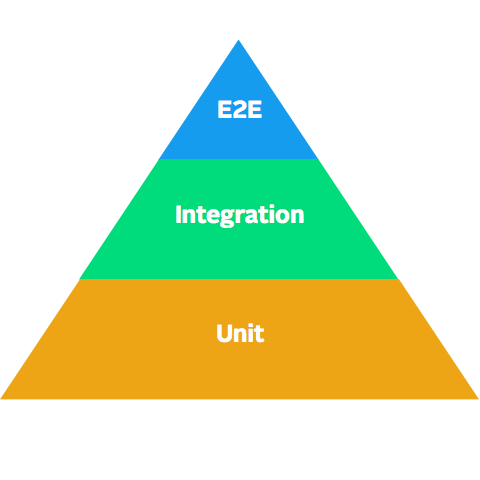
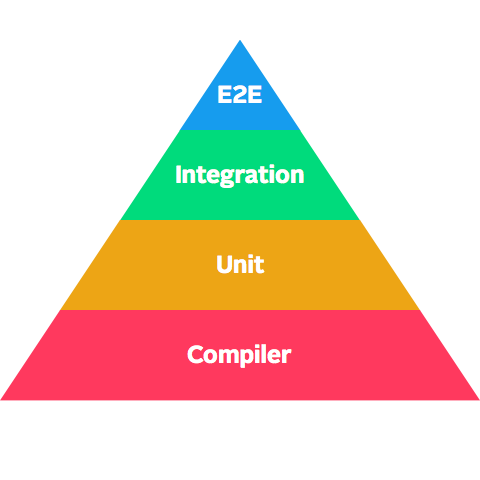

slidenumbers: false
autoscale: true

<br>
<br>	
# Compile time Guaranteed

<br>
####  Nikita Lutsenko
####  @nlutsenko
#### Facebook, Parse

---

# Build & Run

- Compile

^ To begin with, let's take a look at the usual flow of building and running any application.
^ First - we want the compiler to transform our code into something a CPU can interpret, this is a compilation step.

---

# Build & Run

- ✅ Compile
- Link

^ After that is done, linker uses the code that we compiled and links it with all the frameworks that we've used, packages all the compiled code into a single binary, as well as packages our code.

---

# Build & Run

- ✅ Compile
- ✅ Link
- Run

^ After all of the above, we can finally run our application. Yay!


---

# Build & Run

- ✅ Compile
- ✅ Link
- ✅ Run

^ People are happily using your app, developers are building something amazing using your library.
But...

---

# Build & Run

- ✅ Compile
- ✅ Link
- ✅ Run
- ❌ Crash

^ That's not usually what happens.

---


# Build & Run

- ✅ Compile
- ✅ Link
- ✅ Run
- ❌ Crash

^ If everything would be so simple, we would spare so much time.
In most of the cases - our app crashes, or provides some crazy inconsistent behavior.
Why does it happen?

---

# We are Human!

<br><br><br><br><br>
> My brain tells me the truth, and it can't find any errors, therefore I have written perfect software.
-- Zed A. Shaw

^ Single sentence, don't talk over it for a long time...

---

# Solution?

---

# Test all the things!

- Unit
- Integration
- E2E
- Monkey
- Manual
- Dogfooding 🐶
- ...

^ One of the solutions to automate our reasoning about how our software behaves is to write tests.
There are all different ways and types you write tests, things like Unit, Integration, E2E, Monkey, Manual, Dogfooding...
All these are expensive, and time-consuming efforts that sadly not a lot of people put time in.

---

# Pyramid of Testing



^If we take a look at our pyramid of testing (I am sure you are familiar with this graphic from before).
Turns out - there is one piece here that is missing, or rather it's implicit.

---

# Pyramid of Testing (Extended)



^Compiler! It's right there! The easiest, as well as the biggest source of guarantees for how our software runs.

---

# Compilers are not human!

- Syntax
- Types
- Logic
- Variables
- Access Control
- Semantic Analysis
- ...

^ Compilers are not humans, therefore they are awesome! + Bullets

---

# Compiler Guarantees

- 

---

# Compiler Guarantees

- Compiler Errors
  - Syntax
  - Intent

^ Example!
  
---

# Compiler Guarantees

- Compiler Errors
  - Syntax
  - Intent
- Compiler Warnings
  - Potential Problems
  - Misuse or Wrong Use of API
  
^ Example!

---

# Compiler Driven Development

- 
 
---

# Compiler Driven Development

- Fail Early, Fail Often

---

# Compiler Driven Development

- Fail Early, Fail Often
  - **throws** and **Optional()** are your best friends!

---

# Compiler Driven Development

- Fail Early, Fail Often
  - **throws** and **Optional()** are your best friends!
- Never Trust Input

---

# Compiler Driven Development

- Fail Early, Fail Often
  - **throws** and **Optional()** are your best friends!
- Never Trust Input
  - `!` vs `?`
  
---

# Compiler Driven Development

- Fail Early, Fail Often
  - **throws** and **Optional()** are your best friends!
- Never Trust Input
  - `!` vs `?`
- Protect Everything
  
---

# Compiler Driven Development

- Fail Early, Fail Often
  - **throws** and **Optional()** are your best friends!
- Never Trust Input
  - `!` vs `?`
- Protect Everything
  - `guard`, `if`, `switch`, `where`

---

# Compiler Driven Development

- Constants not Variables
  
---

# Compiler Driven Development

- Constants not Variables
  - ~~var~~ **let**
  
---

# Compiler Driven Development

- Constants not Variables
  - ~~var~~ **let**
- Be Explicit!
  
---

# Compiler Driven Development

- Constants not Variables
  - ~~var~~ **let**
- Be Explicit!
  - `final`, `private`, `public`
  
---

# Compiler Driven Development

- Constants not Variables
  - ~~var~~ **let**
- Be Explicit!
  - `final`, `private`, `public`
- Prevention Over Documentation
  - Prevent unsupported behaviour

---

```swift
class YarrRequest {
   
}
```

---

```swift
class YarrRequest {
   init(urlString: String) {
       let request = NSMutableURLRequest(URL: NSURL(string: urlString)!)
       request.addValue("captain", forHTTPHeaderField: "Authorization")
   }
}
```

---

```swift
class YarrRequest {
   init(urlString: String) {
       let request = NSMutableURLRequest(URL: NSURL(string: urlString)!)
       request.addValue("captain", forHTTPHeaderField: "Authorization")
   }
   
   func perform() {
        // Perform `request`...
   }
}
```

---

```swift
class YarrRequest {
    var request = NSMutableURLRequest()

    init(urlString: String) {
        request.URL = NSURL(string: urlString)!
        request.addValue("captain", forHTTPHeaderField: "Authorization")
    }

    func perform() {
        // Perform `request`...
    }
}
```

---

```swift
class YarrRequest {
    var request = NSMutableURLRequest()

    init(urlString: String) {
        request.URL = NSURL(string: urlString)!
        request.addValue("captain", forHTTPHeaderField: "Authorization")
    }

    func perform() { ... }
}

let request = YarrRequest(urlString: "http://yarr.com")
request.perform()
```

---

```swift
class YarrRequest {
    var request = NSMutableURLRequest()

    init(urlString: String) {
        request.URL = NSURL(string: urlString)!
        request.addValue("captain", forHTTPHeaderField: "Authorization")
    }

    func perform() { ... }
}

let request = YarrRequest(urlString: "Yolo™")
request.perform()
```

---

```swift
class YarrRequest {
    var request = NSMutableURLRequest()

    init(urlString: String) {
        request.URL = NSURL(string: urlString)!
        request.addValue("captain", forHTTPHeaderField: "Authorization")
    }

    func perform() { ... }
}

let request = YarrRequest(urlString: "Yolo™") // ❌ Crash! 
request.perform()
```

---

```swift
class YarrRequest {
    var request = NSMutableURLRequest()

    init(urlString: String) {
        request.URL = NSURL(string: urlString)!
        request.addValue("captain", forHTTPHeaderField: "Authorization")
    }

    func perform() { ... }
}

let request = YarrRequest(urlString: "Yolo™") // ❌ Crash! (🐥?)
request.perform()
```

---

```swift
class YarrRequest {
    var request = NSMutableURLRequest()

    init(urlString: String) {
        request.URL = NSURL(string: urlString)!
        // Implicitly unwrapped optional!    ^^^
        request.addValue("captain", forHTTPHeaderField: "Authorization")
    }

    func perform() { ... }
}

let request = YarrRequest(urlString: "Yolo™") // ❌ Crash! (🐥!)
request.perform()
```

---

```swift
class YarrRequest {
    var request = NSMutableURLRequest()

    init(urlString: String) throws {
        guard let url = NSURL(string: urlString) else { throw NSError() }
        request.URL = url
        request.addValue("captain", forHTTPHeaderField: "Authorization")
    }

    func perform() { ... }
}

do {
  let request = try YarrRequest(urlString: "Yolo™")
  request.perform()
} catch { ... }
```

---

```swift
class YarrRequest {
    var request = NSMutableURLRequest()

    init(urlString: String) throws {
        guard let url = NSURL(string: urlString) else { throw NSError() }
        request.URL = url
        request.addValue("captain", forHTTPHeaderField: "Authorization")
    }

    func perform() { ... }
}

do {
  let request = try YarrRequest(urlString: "http://yarr.com")
  request.request = NSMutableURLRequest(URL: NSURL()) // Different request!
  request.perform()
} catch { ... }
```

---

```swift
class YarrRequest {
    var request = NSMutableURLRequest()

    init(urlString: String) throws {
        guard let url = NSURL(string: urlString) else { throw NSError() }
        request.URL = url
        request.addValue("captain", forHTTPHeaderField: "Authorization")
    }

    func perform() { ... }
}

do {
  let request = try YarrRequest(urlString: "http://yarr.com")
  request.request = NSMutableURLRequest(URL: NSURL()) // Different request!
  request.perform() // 🐥?
} catch { ... }
```

---

```swift
class YarrRequest { 
    let request = NSMutableURLRequest()
//  ^^ `let` not `var`  

    init(urlString: String) throws {
         guard let url = NSURL(string: urlString) else { throw NSError() }
         request.URL = url
         request.addValue("captain", forHTTPHeaderField: "Authorization")
    }

    func perform() { ... }
}

do {
  let request = try YarrRequest(urlString: "http://yarr.com")
  request.request = NSMutableURLRequest(URL: NSURL()) // ❌ Compiler Error
  request.perform() // 🐥!
} catch { ... }
```

---

```swift
class YarrRequest { 
    let request = NSMutableURLRequest()

    init(urlString: String) throws {
         guard let url = NSURL(string: urlString) else { throw NSError() }
         request.URL = url
         request.addValue("captain", forHTTPHeaderField: "Authorization")
    }

    func perform() { ... }
}

do {
  let request = try YarrRequest(urlString: "http://yarr.com")
  request.request.URL = NSURL() // Different URL
  request.perform()
} catch { ... }
```

---

```swift
class YarrRequest { 
    let request = NSMutableURLRequest()

    init(urlString: String) throws {
         guard let url = NSURL(string: urlString) else { throw NSError() }
         request.URL = url
         request.addValue("captain", forHTTPHeaderField: "Authorization")
    }

    func perform() { ... }
}

do {
  let request = try YarrRequest(urlString: "http://yarr.com")
  request.request.URL = NSURL() // Different URL!
  request.perform() // 🐥?
} catch { ... }
```

---

```swift
// YarrRequest.swift
class YarrRequest { 
    private let request = NSMutableURLRequest()

    init(urlString: String) throws {
         guard let url = NSURL(string: urlString) else { throw NSError() }
         request.URL = url
         request.addValue("captain", forHTTPHeaderField: "Authorization")
    }

    func perform() { ... }
}

// Main.swift
do {
  let request = try YarrRequest(urlString: "http://yarr.com")
  request.request.URL = NSURL() // ❌ Compiler Error
  request.perform() // 🐥!
} catch { ... }
```

---

# Compiler Driven Development

- Be Explicit!
- Never Trust Input
- Protect Everything
- Fail Early, Fail Often
- Constants not Variables
- Prevention Over Documentation


---

# There is more!

- Analyzer Warnings
  - `xcodebuild test`
  - `xcodebuild analyze`
  
---
  
# There is more!

- Analyzer Warnings
  - `xcodebuild test`
  - `xcodebuild analyze`  
- Compiler Warnings
  - Do not ignore warnings!
  
---
  
# There is more!

- Analyzer Warnings
  - `xcodebuild test`
  - `xcodebuild analyze`  
- Compiler Warnings
  - Do not ignore warnings!
  - [tr.im/goshdarnclangwarnings](tr.im/goshdarnclangwarnings) by @mattt
  
---
  
# There is more!

- Analyzer Warnings
  - `xcodebuild test`
  - `xcodebuild analyze`  
- Compiler Warnings
  - Do not ignore warnings!
  - [tr.im/goshdarnclangwarnings](tr.im/goshdarnclangwarnings) by @mattt
  - 26 Lexer, 21 Parser, 234 Semantic Warnings
  
---
  
# There is more in ObjC!

- Target -> Build Settings -> Other Warning Flags

---

# There is more in ObjC!

- Target -> Build Settings -> Other Warning Flags
  - **-Weverything**
  
---

# There is more in ObjC!

- Target -> Build Settings -> Other Warning Flags
  - **-Weverything -Wpedantic**
  
---

# There is more in ObjC!

- Target -> Build Settings -> Other Warning Flags
  - **-Weverything -Wpedantic**
- Disable if necessary:
  ```#pragma clang diagnostic push
  #pragma clang diagnostic ignored "-W<FLAG>"
  // ...
  #pragma clang diagnostic pop
  ```


---

### Questions?

##### [github.com/nlutsenko/compile-time-guaranteed](https://github.com/nlutsenko/compile-time-guaranteed)


---

